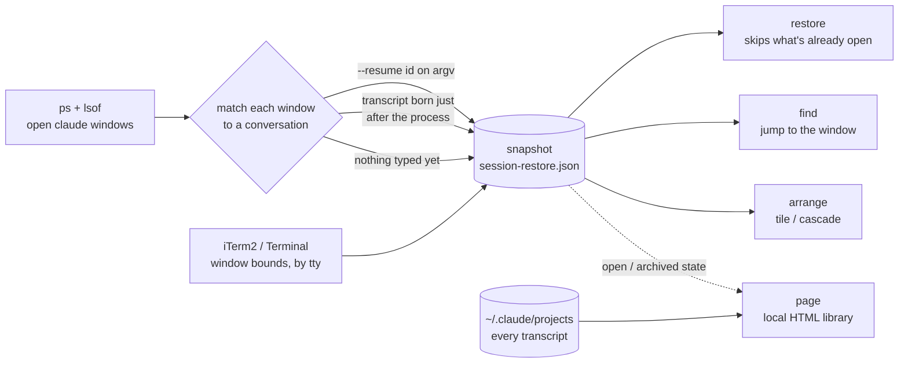

# claude-sessions

You have fourteen Claude Code windows open. Different repos, different
conversations, each one carrying an hour of context you'd rather not rebuild.
Then you need to reboot.

The conversations survive — Claude Code writes every one of them to disk. What
doesn't survive is knowing **which window was on which conversation**, and where
it sat on your screen. Fourteen `claude --resume` pickers won't tell you that.

`claude-sessions` records it and replays it.

```bash
claude-sessions save        # before you reboot
claude-sessions restore     # after
```

Ships as a **Claude Code skill** and a standalone CLI.

## What it does



## Use

```bash
claude-sessions save              # snapshot the open windows
claude-sessions list              # show it, with a title per session
claude-sessions restore           # reopen what's missing, where it used to sit
claude-sessions restore --dry-run # print the commands, open nothing
claude-sessions doctor            # show exactly what it can and cannot see

claude-sessions install-auto      # snapshot every 10 min via launchd
```

`list` reads like something human, because each entry carries a title taken from
the conversation's first message:

```text
3 window(s), snapshot taken 2026-03-04 18:22:
  ~/dev/api-gateway   [open now]
     3f2a9c14  rate limiter is dropping requests under load
  ~/dev/mobile-app
     7d4e1b90  migrate the onboarding flow off the old SDK
  ~/dev/infra   [remembered]
     b81c5f37  terraform plan wants to replace the whole cluster
```

`restore` reconciles rather than replays — it reopens only what isn't already
open, so running it twice doesn't give you duplicates:

```text
$ claude-sessions restore
reopening 5 window(s) via iTerm2 (12 already open, skipped) ...
reopened 5 of 5 window(s)
```

*(output above is illustrative)*

## "Where's my gateway session — is it even open?"

```bash
claude-sessions find gateway
claude-sessions find gateway --go     # bring that window forward, or reopen it
```

```text
$ claude-sessions find gateway
2 match(es) for 'gateway':
  OPEN ~/dev/api-gateway  [ttys021, at 1518,757]
        rate limiter is dropping requests under load
        left off: can we shed load per-tenant instead of globally?
       ~/dev/gateway-docs
        write up the retry semantics for the SDK teams
        cd ~/dev/gateway-docs && claude --resume 8f84baff-...
```

It searches the directory, branch, opening prompt, last prompt and the whole
thread of every conversation — open or not. `--go` brings the top match's window
to the front if it's running, and reopens it if it isn't.

## Remembering what you closed

A window you closed on purpose should be remembered, not reopened:

```bash
claude-sessions archive --gone      # everything not open right now
claude-sessions archive glossfm     # or by directory / session id
claude-sessions page --open         # browse the lot
```

`page` writes a self-contained HTML file (`~/.claude/sessions.html`) listing
every conversation you've had: what you opened it with, **where you left off**,
directory and branch, whether it's open / closed / archived, and a click-to-copy
`claude --resume` command.

Click a conversation to drill in — every prompt you typed, with times. Search
runs over those threads too, auto-opens the conversations that match and
highlights the hits, so you can find a session by something you said halfway
through it. `/` focuses search, `Escape` collapses, `--fast` skips reading the
full transcripts.

Nothing is uploaded. It's a local file.

## Arranging windows

```bash
claude-sessions arrange grid                 # tile everything that's open
claude-sessions arrange grid --cols 4
claude-sessions arrange cascade
claude-sessions arrange saved                # back to the snapshot's positions
claude-sessions arrange grid --busy-first    # sessions working right now get the first cells
claude-sessions arrange grid --rect 0,0,2560,1440   # confine to one display

claude-sessions install-arrange grid --busy-first   # do it automatically
```

`restore` also takes `--layout grid|cascade|saved|none`. The automatic mode
re-tiles **only when a window opens or closes**, so a window you drag somewhere
on purpose stays where you put it.

## Install

```bash
git clone https://github.com/jhammant/claude-sessions ~/dev/claude-sessions
ln -s ~/dev/claude-sessions/skill ~/.claude/skills/claude-sessions          # as a skill
ln -s ~/dev/claude-sessions/skill/scripts/claude-sessions ~/.local/bin/     # as a CLI
```

No dependencies beyond python3 and macOS. A skill is enumerated when a Claude
Code window *starts*, so windows that were already open won't see it until
they're restarted.

## How it works

`ps` finds the windows, `lsof` gives each one's working directory, and the
directory maps into `~/.claude/projects/` by replacing `/` and `.` with `-`.
Window positions come from iTerm2/Terminal via the tty each process is on.

Claude Code doesn't hold its transcript file open, so there's no direct
process-to-session handle. Each window is matched in passes, and `doctor` tells
you which one applied:

| how | confidence | when |
| --- | --- | --- |
| `resume` | exact | the session id is on the process command line |
| `start` | strong | the transcript was created moments after the process began |
| `mtime` | a guess | most recently written unclaimed transcript in that directory |
| `fresh` | n/a | the window has no conversation yet |

Because a restored window carries `--resume <id>` on its command line, the
mapping is exact from the first restore onward — it self-heals.

A transcript that already existed *before* a process started is never matched to
it. That matters more than it sounds: hooks and other tooling run headless
`claude -p` jobs whose transcripts land in the same project directory, and a
naive "most recently modified" match will hand your window someone else's
conversation. Transcripts are filtered by their `entrypoint` field — `cli` is a
window you sat in front of, `sdk-cli`/`sdk-py` is a script. Discovery likewise
ignores headless processes, processes with no controlling terminal, and the
helper `claude` children a window forks.

## Two things it won't do to you

**It never shrinks the snapshot.** `save` merges: a window that's no longer
running is remembered (for `--keep-hours`, default 72) rather than deleted. The
failure that actually loses your work is a restore that half-succeeds followed
by an automatic save overwriting the good snapshot with the smaller one.
`save --replace` opts out. Every snapshot is also copied to
`~/.claude/session-restore.d/` (last 30) — `list --history` and
`restore --source <n>` go back.

**It never fails silently.** `restore` verifies every window it creates, retries,
and prints the exact command for anything it couldn't reopen. `doctor` says out
loud when a window can't be identified or positioned.

## Scope

macOS. Drives iTerm2 if it's running, Terminal otherwise — iTerm2 is the
better-tested path. Read-only apart from two files under `~/.claude`
(`session-restore.json`, override with `CLAUDE_SESSIONS_STATE`, and the
generated `sessions.html`). Nothing is sent anywhere.

## Licence

MIT.
